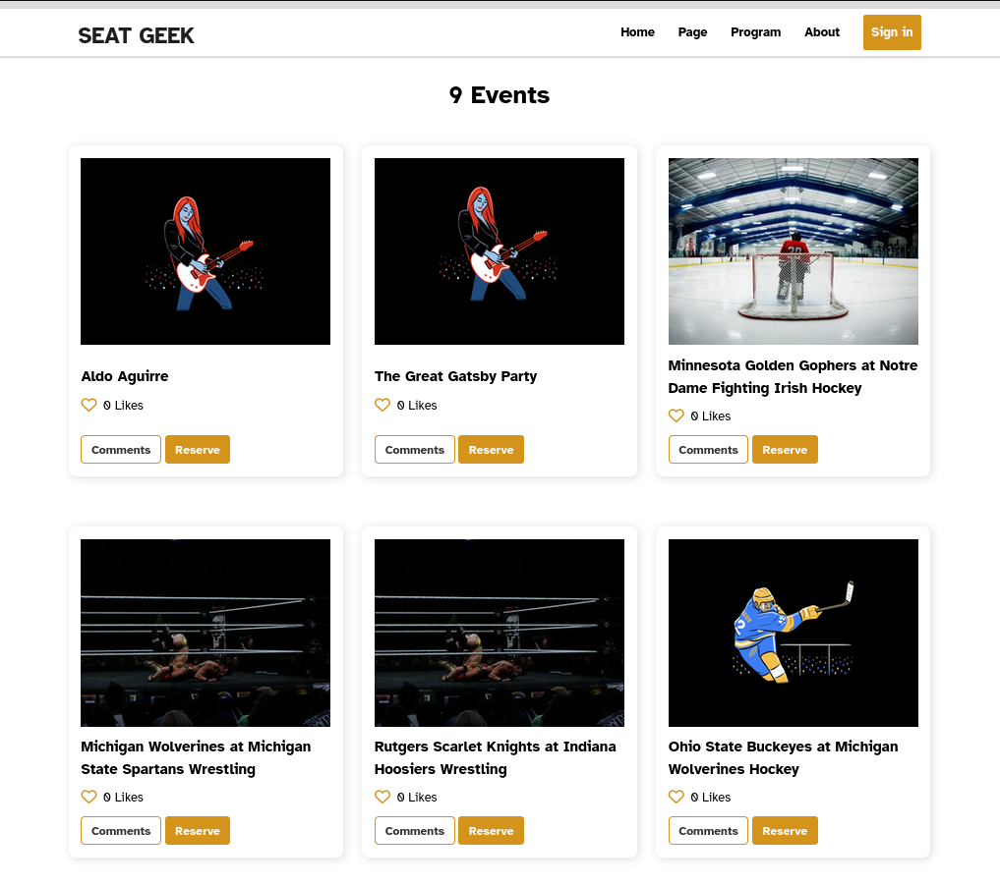

<a name="readme-top"></a>

<div align="center">

  
  <br/>

  <h2><b>Event Hub: SEAT GEEK</b></h2>

</div>

<!-- TABLE OF CONTENTS -->

# 📗 Table of Contents

- [📖 About the Project](#about-project)
  - [🛠 Built With](#built-with)
    - [Tech Stack](#tech-stack)
    - [Key Features](#key-features)
  - [🚀 Live Demo](#live-demo)
- [💻 Getting Started](#getting-started)
  - [Setup](#setup)
  - [Prerequisites](#prerequisites)
  - [Install](#install)
  - [Usage](#usage)
  - [Run tests](#run-tests)
  - [Deployment](#triangular_flag_on_post-deployment)
- [👥 Authors](#authors)
- [🔭 Future Features](#future-features)
- [🤝 Contributing](#contributing)
- [⭐️ Show your support](#support)
- [❓ FAQ ](#faq)
- [📝 License](#license)

<!-- PROJECT DESCRIPTION -->

# 📖 EventHub <a name="about-project"></a>

**EventHub** is a single page web application that allows users to view and interact with upcoming events.

 

 </br>

## 🛠 Built With <a name="built-with"></a>

### Tech Stack <a name="tech-stack"></a>

<ul>
  <li>HTML</li>
  <li>CSS</li>
  <li>JavaScript</li>
  <li>Webpack</li>
</ul>

<!-- Features -->

### Key Features <a name="key-features"></a>

- Use of third-party APIs with authentication
- Dynamically create & show list of events to DOM
- Refresh likes real-time

<p align="right">(<a href="#readme-top">back to top</a>)</p>

<!-- LIVE DEMO -->

## 🚀 Live Demo <a name="live-demo"></a>

- [Live Demo Link](https://example.com)
- [Video presentation](https://drive.google.com/file/d/1HM-Xi3iKlr4Sg8hfnutWkcRTyrSiGWf8/view)

<p align="right">(<a href="#readme-top">back to top</a>)</p>

<!-- GETTING STARTED -->

## 💻 Getting Started <a name="getting-started"></a>

To get a local copy up and running, follow these steps.

### Prerequisites

- NPM installed locally

### Setup

Clone this repository to your desired folder:

```sh
git clone git@github.com:HunterX-7:JS-Capstone-project
```

### Install

Install this project with:

```sh
npm install
```

### Usage

To run the project, execute the following command:

```sh
npm run start
```

### Run tests

To run tests, run the following command:

```sh
npm run test
```

### Deployment

Build the project:

```sh
npm run build
```

Deploy it to Vercel or Netlify

<p align="right">(<a href="#readme-top">back to top</a>)</p>

<!-- AUTHORS -->

## 👥 Authors <a name="authors"></a>

👤 **Francisco Quintero**

- GitHub: [@HunterX-7](https://github.com/HunterX-7)
- Twitter: [@franquin07](https://twitter.com/franquin07)
- LinkedIn: [Francisco Quintero](https://www.linkedin.com/in/francisco-quintero-146423252/)

👤 **ISRAEL CHIZUNGU**

- GitHub: [chiztechnology](https://github.com/chiztechnology)
- Twitter: [IsraelChizungu](https://twitter.com/IsraelChizungu)
- LinkedIn: [IsraelChizungu](https://www.linkedin.com/in/israel-chizungu-b70316125/)

👤 **Rashed Arman**

- GitHub: [@rashedarman](https://github.com/rashedarman)
- Twitter: [@rashedarman21](https://twitter.com/rashedarman21)
- LinkedIn: [Rashed Arman](https://linkedin.com/in/rashedarman)

<p align="right">(<a href="#readme-top">back to top</a>)</p>

<!-- FUTURE FEATURES -->

## 🔭 Future Features <a name="future-features"></a>

- [ ] Prevent multiple likes from same user
- [ ] Redesign popup modals

<p align="right">(<a href="#readme-top">back to top</a>)</p>

<!-- CONTRIBUTING -->

## 🤝 Contributing <a name="contributing"></a>

Contributions, issues, and feature requests are welcome!

Feel free to check the [issues page](../../issues/).

<p align="right">(<a href="#readme-top">back to top</a>)</p>

<!-- SUPPORT -->

## ⭐️ Show your support <a name="support"></a>

I really enjoyed working on this project. If you like it show your support by giving a star.

<p align="right">(<a href="#readme-top">back to top</a>)</p>

<!-- FAQ (optional) -->

## ❓ FAQ <a name="faq"></a>

- **Where do I get API keys?**
  - This project uses [Seat Geek](https://platform.seatgeek.com/)

<p align="right">(<a href="#readme-top">back to top</a>)</p>

<!-- LICENSE -->

## 📝 License <a name="license"></a>

This project is [MIT](./LICENSE) licensed.

<p align="right">(<a href="#readme-top">back to top</a>)</p>
